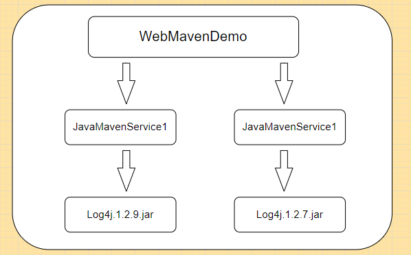

## 依赖版本的原则
依赖版本的原则有两种
- 路径最短者优先原则
- 路径相同先声明优先原则

### 路径最短者优先原则

`Service2`的log4j的版本是`1.2.7`版本，`Service1`排除了此包的依赖，自己加了一个Log4j的`1.2.9`的版本

那么`WebMavenDemo`项目遵守路径最短优先原则，Log4j的版本和Sercive1的版本一致。

### 路径相同先声明优先原则

这种场景依赖关系发生了变化，`WebMavenDemo项目依赖Sercive1和Service2`

它俩是同一个路径，那么谁在`WebMavenDemo的pom.xml`中先声明的依赖就用谁的版本。